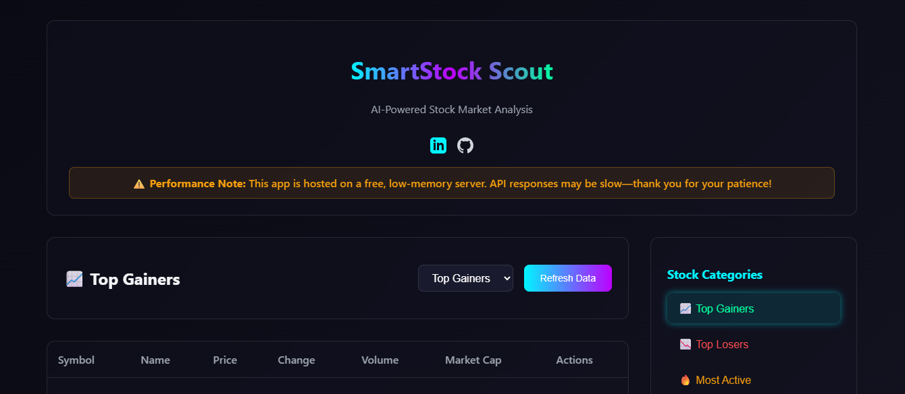

---

# SmartStock Scout 📈

**Live App:** [https://smartstock-scout.netlify.app/](https://smartstock-scout.netlify.app/)

An AI-powered stock market analyzer that scrapes Yahoo Finance data and performs sentiment analysis using Hugging Face models.



## Features ✨

* Real-time stock data scraping from Yahoo Finance
* AI-powered sentiment analysis of financial news
* Top gainers, losers, and most-active stock tracking
* Clean and responsive dashboard
* CSV export support
* Docker-ready for simple deployment

## Live Demo 🚀

Try it here: **[https://smartstock-scout.netlify.app/](https://smartstock-scout.netlify.app/)**

## Tech Stack 🛠️

* **Backend**: Node.js, Express, Puppeteer
* **Frontend**: React
* **AI**: Hugging Face Inference API
* **Deployment**: Netlify, Docker

## Installation ⚙️

### Prerequisites

* Node.js v16+
* Hugging Face API token

### Setup

```bash
git clone https://github.com/yshraj/smartstock-scout
cd smartstock-scout
npm install
cp .env.example .env
```

### Environment Variables

```env
HF_TOKEN=your_hugging_face_api_token
PORT=3000
```

## Usage 🚀

### Development

```bash
npm run dev
```

### Production

```bash
npm run build
npm start
```

### Docker

```bash
docker build -t smartstock-scout .
docker run -p 3000:3000 smartstock-scout
```

## API Endpoints 🌐

* `GET /api/stocks?type=gainers|losers|most-active`
* `GET /api/stock/:symbol`
* `GET /api/analyze?symbol=SYMBOL`

## Project Structure 📁

```
smartstock-scout/
├── ai/
├── build/
├── public/
├── scraper/
├── src/
│   ├── components/
│   └── utils/
├── Dockerfile
├── server.js
└── README.md
```

## Contributing 🤝

1. Fork this repo
2. Create a new branch
3. Commit your changes
4. Open a pull request

---
